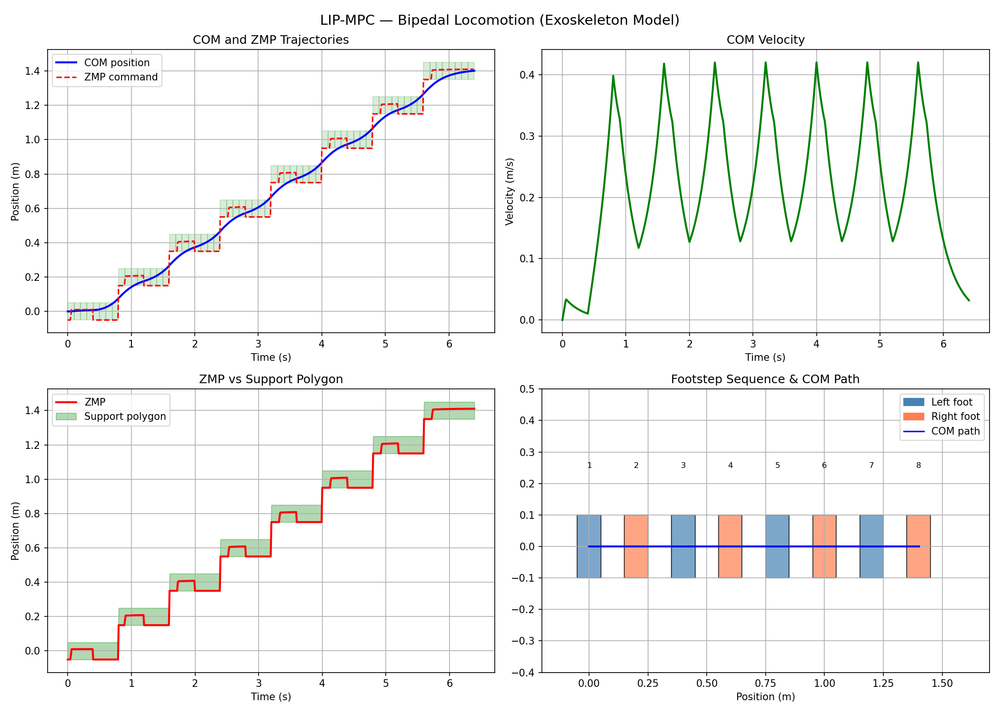

# LIP-MPC Biped — Bipedal Locomotion with Model Predictive Control

## Overview
Implementation of a Model Predictive Controller (MPC) for bipedal locomotion
based on the Linear Inverted Pendulum (LIP) model. The controller plans the
Center of Mass (COM) trajectory over a sequence of footsteps while keeping
the Zero Moment Point (ZMP) within the support polygon at all times.

This project models the exact control problem solved in walking exoskeletons
like Wandercraft's Atalante X — stabilizing a bipedal system through
predictive ZMP-based trajectory planning.

## Physical Model

The human body (or exoskeleton) is modeled as a point mass at constant
height h, supported by a massless rigid leg. Under the constraint z = h,
the dynamics reduce to a linear system — the Linear Inverted Pendulum.

System parameters (exoskeleton-scale):
- COM height  : h = 0.8m
- Step length : 0.2m
- Step duration: 0.8s
- Foot size   : 0.1m

## Theory

### Lagrangian Derivation
The LIP equation of motion is derived from first principles using
Lagrangian mechanics.

System coordinates: COM position x, constant height z = h
Kinetic energy   : T = 0.5 * m * x_dot^2   (z_dot = 0)
Potential energy : V = m * g * h            (constant)
Lagrangian       : L = T - V

Euler-Lagrange equation:
    m * x_ddot = Q_x

Reaction force along the massless leg:
    R = m*g / cos(theta)
    Q_x = R * sin(theta) = m*g * tan(theta) = m*g * (x-p)/h

Final equation of motion (exact, no approximation):
    x_ddot = omega^2 * (x - p)
    omega  = sqrt(g/h)

Note: linearity is an exact consequence of z = constant,
not a small-angle approximation.

### State Space Formulation
State  : X = [x, x_dot]
Input  : u = p  (ZMP position)

Continuous:
    X_dot = Ac*X + Bc*u
    Ac = [[0,      1  ],      Bc = [[0       ],
          [omega^2, 0  ]]           [-omega^2 ]]

Discrete (Euler, dt = 0.01s):
    X_k+1 = A*X_k + B*u_k
    A = I + Ac*dt
    B = Bc*dt

### ZMP Stability Constraint
The ZMP must remain within the support polygon at all times:
    p_min <= p <= p_max
    p_min = foot_center - foot_size/2
    p_max = foot_center + foot_size/2

If ZMP leaves the support polygon, the system falls.

### References
- Kajita et al. (2001). The 3D Linear Inverted Pendulum Mode.
  IEEE/RSJ IROS 2001.
- Kajita et al. (2003). Biped Walking Pattern Generation by using
  Preview Control of Zero-Moment Point. IEEE ICRA 2003.
- Wieber, P.B. (2006). Trajectory Free Linear Model Predictive Control
  for Stable Walking. IEEE-RAS Humanoids 2006.

## MPC Formulation

At each timestep, the controller solves:

minimize    sum_{k=0}^{N-1} [ q_x*(x_k - x_ref_k)^2
                             + q_v*(xdot_k - xdot_ref_k)^2
                             + q_zmp*p_k^2 ]
            + 10*q_x*(x_N - x_ref_N)^2

subject to  X_{k+1} = A*X_k + B*p_k      (LIP dynamics)
            p_min_k <= p_k <= p_max_k     (ZMP in support polygon)
            X_0 = X_current               (initial condition)

Where:
- N = 40          prediction horizon
- q_x   = 1000    COM position tracking weight
- q_v   = 100     COM velocity weight
- q_zmp = 0.01    ZMP effort weight

Solved at each timestep using CasADi with IPOPT solver.

## Results

- COM position tracks the footstep sequence smoothly
- ZMP remains within support polygon at every timestep
- COM velocity shows natural gait oscillations between steps
- 8 alternating footsteps (left/right) successfully completed

## Project Structure

    LIP-MPC-Biped/
    ├── src/
    │   ├── lip_model.py
    │   ├── mpc_lip.py
    │   └── gait_scheduler.py
    ├── theory/
    │   └── lip_derivation.md
    ├── results/
    │   └── lip_mpc_result.png
    ├── requirements.txt
    └── main.py

## Setup & Run

### 1. Create virtual environment (recommended)

Linux/macOS:
python3 -m venv venv
source venv/bin/activate

Windows:
python -m venv venv
venv\Scripts\activate

### 2. Install dependencies
pip install -r requirements.txt

### 3. Run
python3 main.py

### Notes
- Python 3.8+ required
- No GPU required
- CasADi with IPOPT solver included in pip package
- Tested on Linux (Ubuntu 22.04), Windows 10/11

## Relevance to Wandercraft
The LIP-MPC framework is the industry-standard approach for bipedal
locomotion planning. In Atalante X, a similar pipeline plans the COM
trajectory in real time, ensuring the ZMP stays within the support
polygon during each step. This project implements that exact pipeline
from first principles — from Lagrangian derivation to MPC solver.

## Author
Meriam Yanelle Ghezloun — Robotics Engineer
LinkedIn: https://www.linkedin.com/in/yanelle-ghezloun/
GitHub: https://github.com/yanelle-ghezloun
